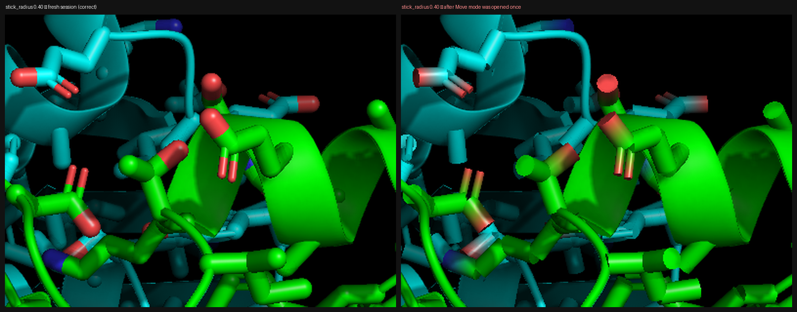

# Sticks render with flat caps and smeared two-color bonds after any CGO cylinder is drawn (Metal)

**Labels:** bug, renderer/metal, regression-class
**Affects:** master, and the shipped **1.11.0 (build 28)** — *not* fixed in 1.11
**Introduced by:** `87fef8e4b feat(metal): render cylinders/sticks as analytic impostors`
**Reported by:** Gabriel Rocklin (Slack) — "Bug rendering sticks when stick_radius is set larger (this is 0.4)"

## Summary

On the Metal renderer the cylinder impostor does **not** carry the per-cylinder `a_cap`
vertex attribute. Instead, `a_cap` is captured into a **process-global** on
`CCGORenderer` and passed to every cylinder draw as a single uniform. The global has one
writer and **no reset**, so the last CGO to supply a constant `a_cap` dictates the cap
flags *and* the color-interpolation mode for every cylinder drawn afterwards — across
objects, reps and frames, for the rest of the process.

The Move-mode gizmo is built entirely from `cgo.CYLINDER`, which maps to
`cCylShaderBothCapsFlat | cCylShaderInterpColor` (`0x13`). **Opening Move mode once
permanently switches every stick in the session to flat caps + linear color
interpolation.** Closing Move mode and deleting the gizmo does not restore correct
rendering.

This is the same defect that produced the gizmo's "visible junctions between ring
segments". That symptom was masked in `270f3f881` (densely sample the rings, paste a
sphere impostor over every seam) rather than fixed — which is why it has resurfaced on
sticks.

## Visual



Left: `stick_radius 0.4` in a fresh session — sharp mid-bond color split, rounded lit
caps. Right: the identical scene after Move mode has been opened once — carbon→oxygen
and carbon→nitrogen blend over a long pale ramp, and stick ends are flat-shaded discs.
The right panel is a point-for-point match to the reported screenshot.

## Reproduction

Deterministic, no UI needed (uses the `PYMOL_AUTOCMD` / `PYMOL_AUTOEXPORT` test
affordances, so it renders the real Metal pipeline offscreen):

```sh
cat > /tmp/poison.py <<'PY'
from pymol import cmd, cgo
cmd.load_cgo([cgo.CYLINDER, 0,0,0, 0.6,0,0, 0.05, 1,0,0, 0,0,1], 'poison')
PY

CMDS="fetch 1ubq, async=0;hide everything;show sticks;util.cnc all;bg_color black;set stick_radius, 0.4"

# A — correct
PYMOL_AUTOCMD="$CMDS" PYMOL_AUTOEXPORT="/tmp/a_clean.png,1200,900" \
  /Applications/RayMol.app/Contents/MacOS/RayMol

# B — one invisible cgo.CYLINDER anywhere in the scene
PYMOL_AUTOCMD="$CMDS;run /tmp/poison.py" PYMOL_AUTOEXPORT="/tmp/b_poisoned.png,1200,900" \
  /Applications/RayMol.app/Contents/MacOS/RayMol
```

In the app: load any structure, `set stick_radius, 0.4`, look at the sidechain tips →
enter Move mode → leave Move mode and delete the gizmo → the tips are now smeared and
flat-capped, and stay that way until relaunch.

## Measured behaviour

RayMol **1.11.0 build 28**, macOS/Metal, 1200×900 offscreen export, barnase–barstar
interface (1BRS chains A+D), cartoon + sidechain sticks.

| Comparison | pixels changed | mean abs Δ |
|---|---|---|
| clean vs one `cgo.CYLINDER` present, `stick_radius 0.40` | **7.74 %** | 7.77 |
| clean vs CGO loaded **then deleted**, `0.40` | **7.74 %** | 7.77 |
| still-present vs deleted (stickiness check) | **0.00 %** (bit-identical) | 0.00 |
| clean vs real `metal_move` gizmo raised then torn down, `0.40` | **9.51 %** | 9.06 |
| clean vs one `cgo.CYLINDER` present, `stick_radius 0.25` | 4.35 % | 4.15 |

Two things this establishes:

1. **It is sticky.** After the CGO is deleted the frame is *bit-identical* to the frame
   with it still present, and still 7.74 % away from clean. Nothing resets the global.
2. **It scales with `stick_radius`,** which is why it was reported at 0.4: the affected
   pixel count and mean error roughly double from 0.25 → 0.40. Both mechanisms are
   linear in `r` — the flat-cap notch where two bond cylinders meet at ~109° is
   `r·tan(θ/2)` deep, and the flat end disc is `πr²`. At the 0.25 default it reads as a
   subtle fringe; at 0.4 it is obvious.

**Geometry is not at fault.** Metal vs the CPU ray-tracer silhouettes agree to within
0.3–1.6 % across `stick_radius` 0.15 → 0.90 (residual is edge antialiasing), so the
impostor bounding box and the ray-cast radius match. The defect is entirely in cap flags
and color interpolation.

## Root cause

`a_cap` is dropped from the Metal vertex layout and replaced by a latched global:

- `layer1/CGOGL.cpp:2350-2351` — the only writer:
  ```cpp
  if (name && strcmp(name, "a_cap") == 0)
    I->metalCylCapConst = vertex_attr->value;
  ```
- `layer1/CGORenderer.h:26` — `float metalCylCapConst = 15.0f;` (`0x0F` = both caps
  round, interp off). Never reset.
- `layer1/CGOGL.cpp:324` — `call.capConst = I->metalCylCapConst;`
- `layerGraphics/metal/RendererMetal.mm:6060` → `u.cap_const`, decoded at `:5768-5773`.
  The source comment at `:5628` states it plainly: *"`a_cap` is supplied as a uniform
  constant (cap_const), not a vertex attribute."*

`drawCylinderImpostorsViaMetal` (`layer1/CGOGL.cpp:305-322`) scans for exactly six
attributes — `attr_vertex1`, `attr_vertex2`, `a_Color`, `a_Color2`, `attr_radius`,
`attr_flags`. There is no `a_cap` and no `capOff` in `CylinderImpostorDrawCall`.

Why sticks specifically inherit someone else's flags:
`CGOConvertShaderCylindersToCylinderShader` emits `a_cap` as a **constant** only when
every cylinder in the CGO shares one cap value (`layer1/CGO.cpp:9496-9541`,
`10095-10097`); otherwise it bakes it **per-vertex** (`layer1/CGO.cpp:10112`).
`RepCylBond` varies caps per bond (`layer2/RepCylBond.cpp:857-866`), so the stick CGO is
heterogeneous → per-vertex → **no constant is ever emitted for sticks** → they silently
render with whatever value was last latched.

And the poisoner: `layer1/CGO.cpp:9516-9517`
```cpp
case cgo::draw::cylinder::op_code:
  cap_value = cCylShaderBothCapsFlat | cCylShaderInterpColor;   // 0x03|0x10 = 0x13 = 19
```
`modules/pymol/metal_move.py:476,499` builds the gizmo from `cgo.CYLINDER` only, so it is
homogeneous and *does* emit the constant → the global becomes 19 for the rest of the
process. In MSL, `0x13` decodes to frontcap=1, endcap=1, round bits clear → **flat caps**
(normal is a constant `thisaxis` → flat-shaded disc), and bit 4 set → `nocolorinterp =
false` →
```
ratio = clamp(ratio, 0.0, 1.0);  color = mix(color1, color2, ratio);
```
a **full-length linear color ramp** along the bond instead of the hard mid-bond step.
That ramp is exactly the washed-out red/blue tips in the report.

`cgo::draw::sausage` (`0x1F`) and `custom_cylinder` also set `cCylShaderInterpColor`, so
they latch the smeared-color variant too.

## The near-miss

`45bc0167a fix(metal): deliver dash radius to cylinder impostors` fixed the *same class*
of bug for `uni_radius` — its own commit message says it "mirrors the existing
metalCylCapConst capture precedent" — and added a per-rep reset:

```cpp
case GL_CYLINDER_SHADER:
  if (I->G->Renderer)
    I->metalCylUniRadius = 0.0f;      // layer1/CGOGL.cpp:2078
```

The equivalent reset for `metalCylCapConst` was never added.

## Proposed fix

**1. Carry `a_cap` per-vertex (the real fix).**
- add `int capOff = -1;` to `CylinderImpostorDrawCall`;
- scan for `a_cap` alongside `attr_flags` in `drawCylinderImpostorsViaMetal`
  (`layer1/CGOGL.cpp:305-322`);
- add `uchar cap [[attribute(6)]]` to MSL `struct CylIn`, pass it through `CylVOut`;
- in `cyl_shade`, use the per-vertex cap when `capOff >= 0`, falling back to
  `u.cap_const` only when the CGO genuinely supplied a constant.

**2. One-line mitigation, shippable immediately** — stop the cross-rep leak by resetting
the global at shader-enable, next to the existing `uni_radius` reset
(`layer1/CGOGL.cpp:2078`):

```cpp
case GL_CYLINDER_SHADER:
  if (I->G->Renderer) {
    I->metalCylUniRadius = 0.0f;
    I->metalCylCapConst  = 15.0f;   // cCylShaderBothCapsRound
  }
```

Note this stops Move mode from corrupting sticks, but sticks would still get the `0x0F`
default (both caps round) rather than their true per-bond caps — so (1) is still needed
for correctness. It also means the gizmo's own segment seams reappear, i.e. `270f3f881`'s
sphere-over-the-seam workaround is still load-bearing until (1) lands.

## Regression test

Render a two-color stick scene at `stick_radius 0.4` twice in one process — once clean,
once after `cmd.load_cgo([cgo.CYLINDER, ...])` — and assert the two frames are identical.
Today they differ by ~8 % of pixels.

## Verification notes

- Reproduced against the shipped `/Applications/RayMol.app` **1.11.0 (build 28)**; the
  defective code is unchanged on `master`. So this is **not** fixed in 1.11.
- The real `metal_move` gizmo path was exercised directly (`metal_move.set_active()` then
  `metal_move._delete_cgo()`), not only the synthetic CGO.
- I did not drive the Move-mode **UI**; the gizmo builder was invoked through its Python
  entry points, which is the same CGO path the UI uses.
