# Materials — Checklist B gallery (#487)

Regenerated for the four materials this ticket implements. 1rx1, identical camera,
colour and lighting throughout; **only the material setting changes**.

The full sweep is 80 renders (5 materials × 4 representations × light/dark background
× ray tracing on/off). Shown here: ray tracing **on**, both backgrounds. Every material
differs from `default` and from every other material on all four representations
(sha256 compared, no two images equal), while the `default` render itself is
byte-identical to master with ray tracing on *and* off.

## The materials

- **`default`** — Today's two-light model. Byte-identical to master.
- **`matte`** — Lambert only — no specular, no grain. The “kill the highlights” look.
- **`marble`** — Veined albedo over the default lighting, plus a waxy light wrap. The veins are *derived* from the base colour, so a coloured object stays that colour.
- **`clay`** — Dead-matte ceramic: faint grain, no specular, dry grazing darkening.
- **`rubber`** — Matte grainy body with a broad dim highlight and a velvet sheen, both tinted toward the base so it never reads as a glossy clear coat.

## Light background

| | cartoon | surface | sticks | spheres |
|---|---|---|---|---|
| **default** | 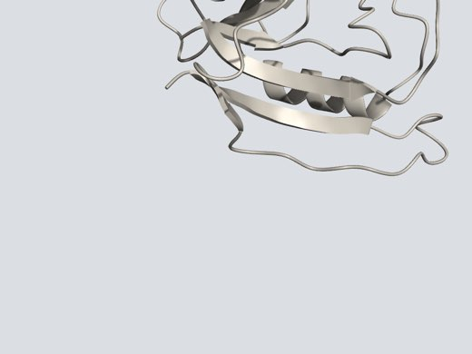 | 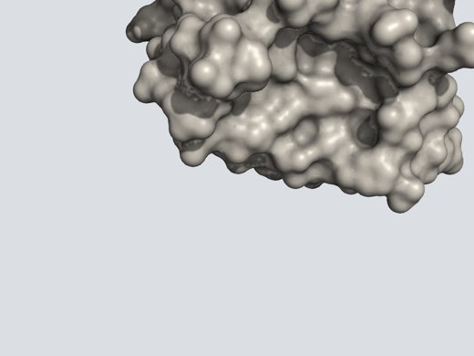 |  |  |
| **matte** |  | 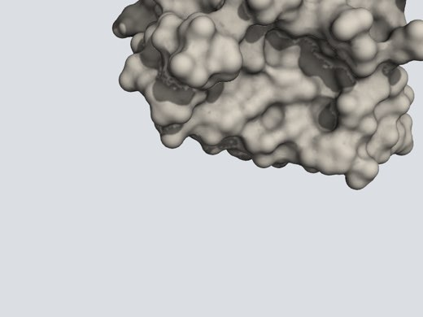 | 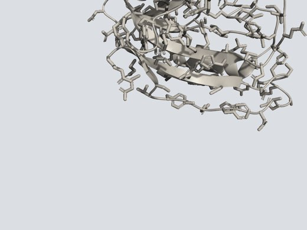 |  |
| **marble** | 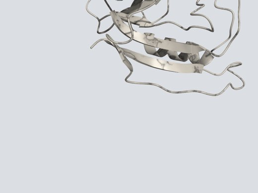 | 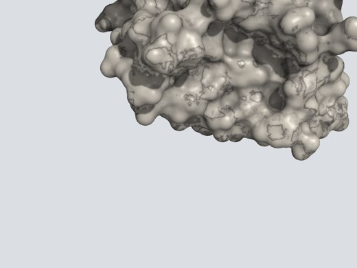 |  | 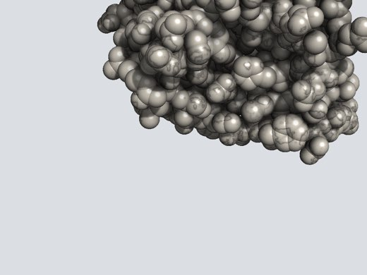 |
| **clay** |  |  |  | 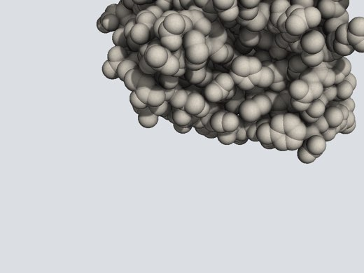 |
| **rubber** | 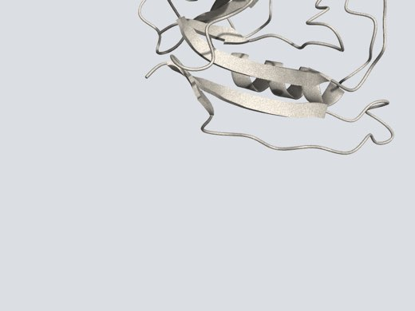 | 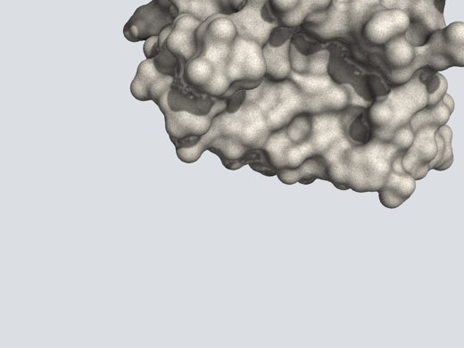 |  | 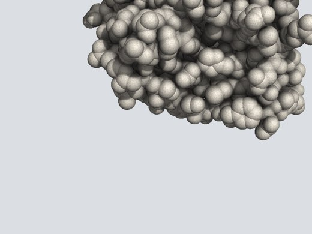 |

## Dark background

| | cartoon | surface | sticks | spheres |
|---|---|---|---|---|
| **default** |  | 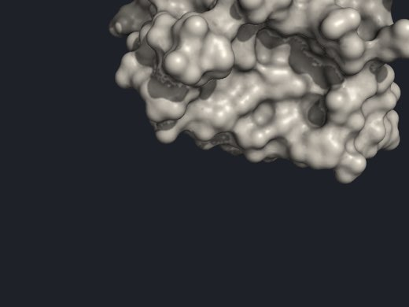 | 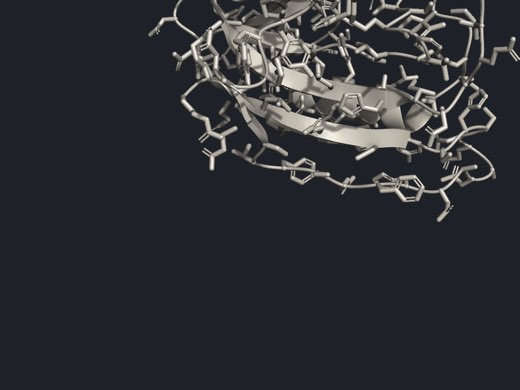 | 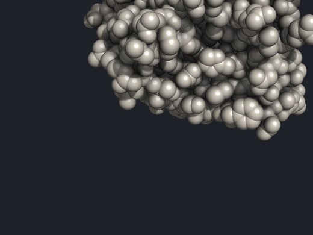 |
| **matte** |  |  | 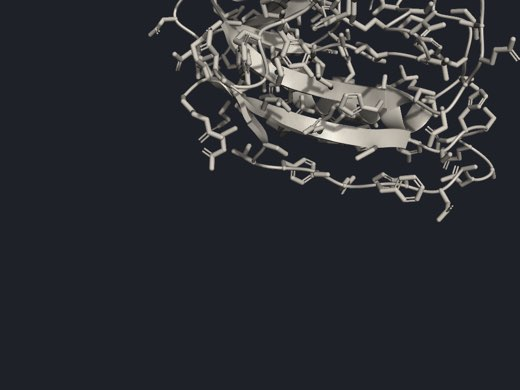 |  |
| **marble** | 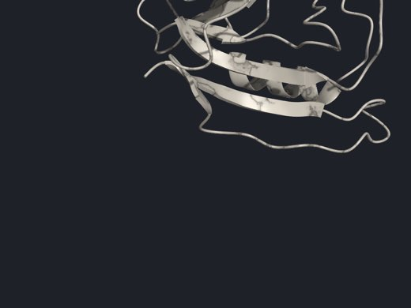 | 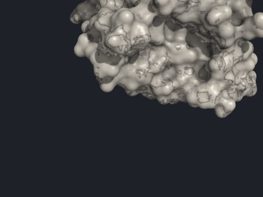 | 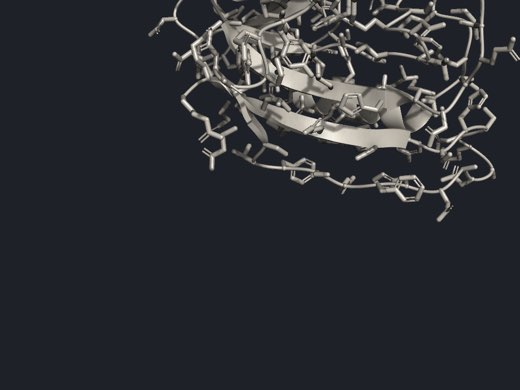 | 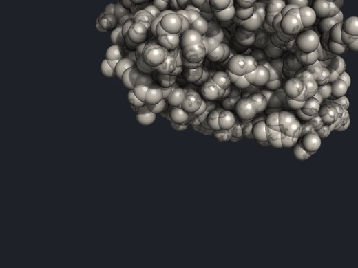 |
| **clay** |  | 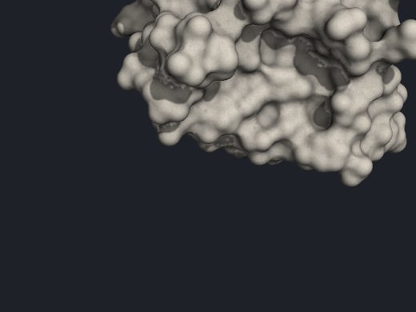 | 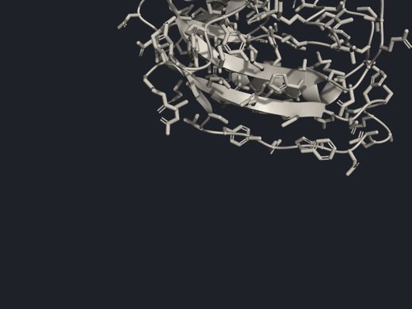 |  |
| **rubber** | 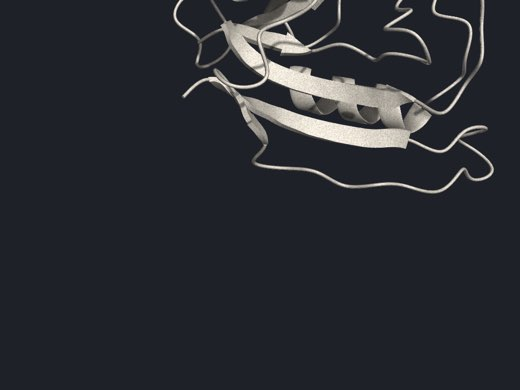 |  | 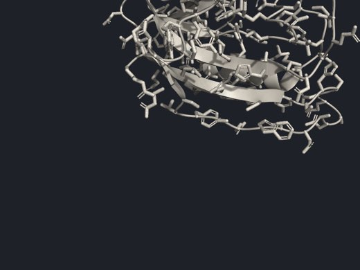 |  |

Generated by `/tmp/mat/gallery.sh` from `/tmp/mat/scene_material.py`; the
procedure is recorded in the PR.
