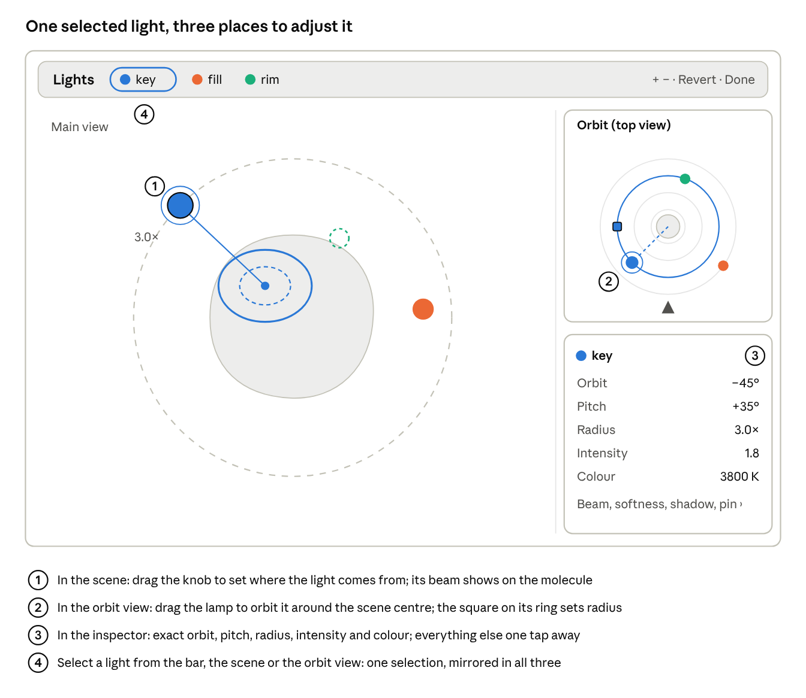
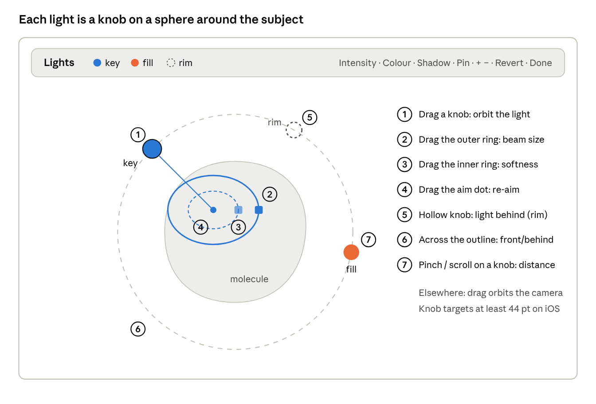
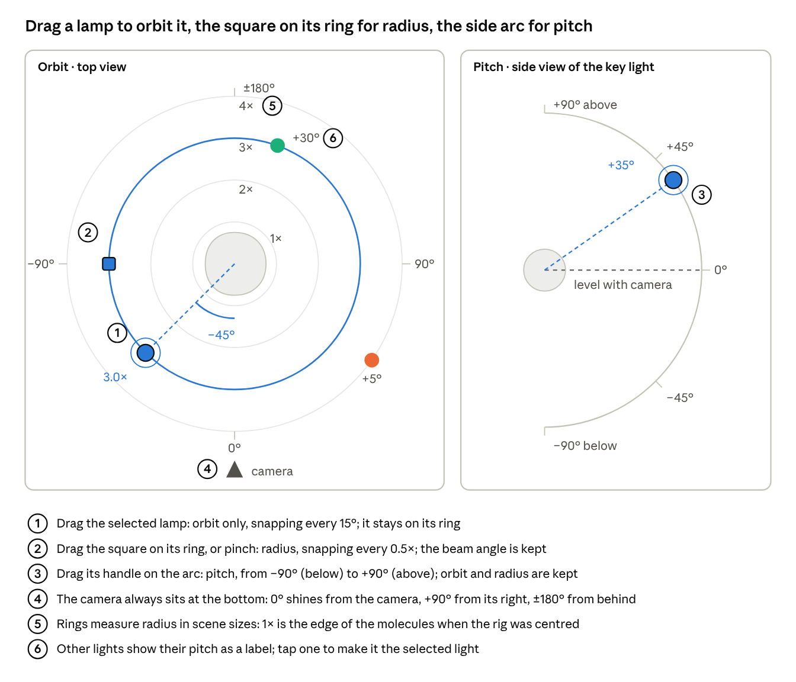
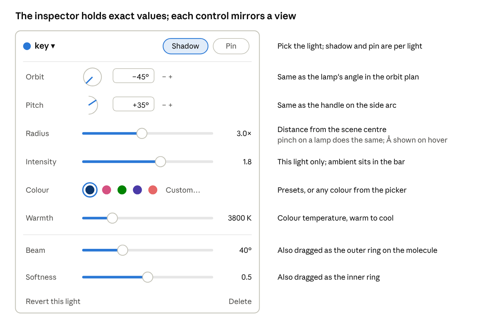
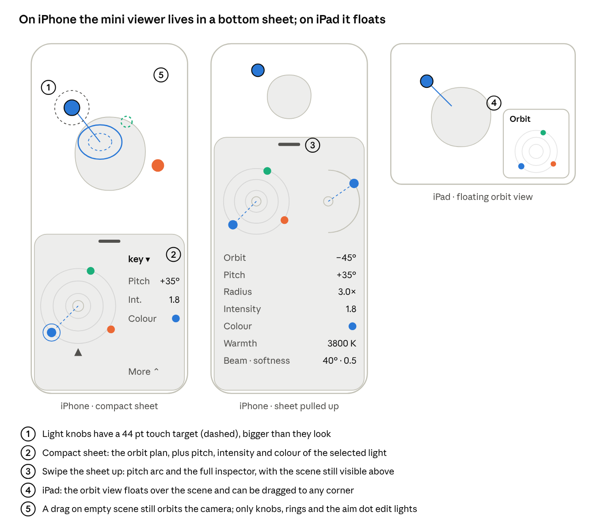

# Lighting: studio lights, per-light shadows, atmosphere and light controls

- **Date:** 2026-10-02
- **Status:** Design for the epic. Tracking issue #610, tickets #611–#627.
- **Prototype:** branch [`proto/studio-lights`](https://github.com/javierbq/RayMol/tree/proto/studio-lights)
  @ `6ffaa2c`, reference only, not for merge. Its guide,
  `docs/studio-lights-prototype/README.md`, maps the code, the shortcuts not
  to carry over and the galleries.
- **Sketches:** `2026-10-02-lighting-epic/` next to this file.

## 1. Summary

RayMol gets photographic lighting on the Metal renderer:

- **Lights:** up to six coloured spot lights placed around the molecule.
- **Shadows:** up to three of the lights cast their own shadows.
- **Air:** haze and drifting dust that make the beams visible.

Lights are set with the `lights` command, presets, or three controls that
share one selection:
- an in-scene gizmo;
- an orbit mini viewer (top-down plan plus pitch arc);
- an inspector.

The rig is saved in `.pse` files and per scene, and movies blend between
scenes' rigs.

**With no rig, every render is byte-identical to today.** A rig never writes
a PyMOL setting, never changes an object's colours or materials, and turning
it off restores the previous look exactly.

**Non-goals (v1):** the CPU `ray` tracer (#626 decides parity or a notice);
OpenGL/Qt; lights as objects in the object panel; area lights and soft shadows
from light size (#625 is a spike); HDR (#624, own ticket); per-object light
linking.

## 2. Decisions

Settled with the user on 2026-10-02, one question at a time. Items marked
*spec* were proposed by this document and approved in review (PR #629).

| # | Topic | Decision |
| --- | --- | --- |
| 1 | Where the rig lives | One rig, owned by the renderer's scene (`CScene`); not objects, not plain settings. Lights do not appear in the object list. |
| 2 | Radius unit | Scene sizes. 1× is the edge of the molecules; Å is shown alongside. |
| 3 | Centre and 1× size | Captured when the rig is created and on *Re-centre* (button and `lights recenter`). Showing, hiding or zooming never moves the lights. |
| 4 | Command names | `lights` for lights and presets, `atmosphere` for haze and dust. |
| 5 | Saving | The `.pse` file saves the rig. Each `scene` stores its own rig and air; recall restores them; scene movies blend between them. |
| 6 | Plan orientation | The orbit plan is always drawn from the camera, which sits at the bottom. Pinned lights circle around the plan as the molecule turns. |
| 7 | Lamp drag in the plan | Orbit only. Radius changes with the square handle on the selected light's ring, a pinch, or the inspector slider. |
| 8 | Radius vs beam | The beam is a cone angle in degrees and stays fixed when radius changes, as with a real spotlight. |
| 9 | Mini viewer form | A flat top-down plan plus a pitch arc for the selected light. |
| 10 | Lamps in the main view | Every light gets a small knob. Only the selected light shows its beam rings, aim dot and handles. |
| 11 | Labels | **Orbit** and **Pitch** (with **Radius**). |
| 12 | Angle zero | Orbit 0° = at the camera, +90° = camera-right, ±180° = behind (rim). Pitch 0° = level with the camera, +90° = above. Same as the prototype's `az`/`el`. |
| 13 | iOS performance | The budget in §8 is the target. It is calibrated on devices at the end of the epic, in #623. #616 and #618 ship the fallback switches and a GPU-time readout so calibration needs no code. |
| 14 | Priority | `tier-1`. |
| 15 | *spec* Classic lights | While a rig is on, PyMOL's own lights are scaled by the rig's `classic` value (default 0), and the rig's `ambient` replaces the `ambient` setting. No setting is written. |
| 16 | *spec* Command grammar | Standard PyMOL argument parsing, not a literal rest-of-line, so `lights` chains with `;`. |
| 17 | *spec* Aim and pin | An aim at a selection stores the point it resolves to at that moment. A pinned light is fixed in world space, not to one object. |

## 3. What the prototype showed

These findings shape the design. The prototype README explains how each was
measured.

- **Coloured rims on neutral subjects read best.** A narrow spot on a binding
  site, glass under several lights, and shadows that take the other lights'
  colour also read well.
- **Per-light shadows are cheap on a Mac.** Three shadowed lights vs none: 0.091
  vs 0.090 s per 1080p frame (Metal RT, 1,300-atom protein). The old
  whole-pixel shadow darkened every light at once, so it is off while studio
  shadows are on.
- **Cone angle vs distance.** At 3 scene sizes, any beam wider than ~25° lights
  the whole molecule. Degrees stay the unit (decision 8). The gizmo's outer
  ring draws the lit patch on the molecule, so the effect of an angle is always
  visible.
- **Backlit haze clips.** Forward scattering peaks at (1+g)/(1−g)², 13× at
  g = 0.65. It is capped at 5× for haze and 8× for dust.
- **Live picking needs native code.** Placing a highlight by clicking needs a
  surface point and normal. A Python ray against every atom is too slow and
  too rough (#614).
- **Packed float strings break.** The prototype stored the rig as two packed
  float-string settings with state on the Python side. `reinitialize` desynced
  them, and scenes did not capture them. Hence the native model in §4.

## 4. The light model (#611)

### 4.1 Rig

A C++ `LightRig` owned by `CScene` (`G->Scene`), replacing the prototype's
file-static state and packed settings.

| Field | Type | Default | Notes |
| --- | --- | --- | --- |
| `enabled` | bool | false | `lights off` clears it and keeps the lights. |
| `lights` | list | empty | 0–6 lights, unique names. |
| `centre` | vec3, world Å | – | Set at creation and on re-centre (§4.3). |
| `size` | float, Å | – | 1×; same capture. |
| `ambient` | float | 0.05 | Replaces the `ambient` setting while on. |
| `classic` | float 0–1 | 0 | Scale on PyMOL's `direct`, `reflect` and `specular` while on. |
| `air` | struct | off | `haze`, `dust`, `dust_size`, `dust_speed`, `scatter` (g), `seed`. |

### 4.2 Light

| Field | Unit / range | Default | Notes |
| --- | --- | --- | --- |
| `name` | text | `key`, `fill`… | Unique within the rig. |
| `anchor` | `camera` \| `pinned` | `camera` | *Pin* in the UI. |
| `orbit` | degrees, −180 to 180 | 0 | Camera lights; see §4.3. |
| `pitch` | degrees, −90 to 90 | 30 | Camera lights. |
| `radius` | scene sizes, 0.5–8 | 4 | Camera lights. |
| `position` | world Å | – | Pinned lights only. |
| `aim` | `centre` \| point | `centre` | A point (world Å) plus the selection text it came from, kept for display. |
| `beam` | degrees, full cone, 1–170 | 45 | Fixed when radius changes (decision 8). |
| `softness` | 0–1 | 0.4 | Fraction of the cone that fades out. |
| `color` | sRGB | white | PyMOL name, `rgb=` or picker. |
| `warmth` | kelvin, 1500–15000 | 6500 | Multiplies `color`; 6500 K is neutral. |
| `intensity` | 0–4 | 1 | Above ~2 clips until HDR (#624). |
| `highlight` | 0–1 | 0.5 | Strength of the coloured specular. |
| `falloff` | exponent, 0–2 | 2 | (aim distance / distance)^falloff: 2 = inverse square, 1 at the aim point; 0 = none. |
| `shadow` | bool | false | At most 3 lights; the 4th is refused with a message. |
| `outline` | bool | false | Beam outline on the geometry (the prototype's `cue`). |

Limits: 6 lights and 3 shadowed lights. #616 revisits the shadow cap after
measuring large assemblies.

### 4.3 Conventions

- **Eye-space position** of a camera light, with `c` the rig centre in eye
  space and `s` the rig size:
  `p = c + radius·s·(sin orbit·cos pitch, sin pitch, cos orbit·cos pitch)`.
  +x is camera-right, +y camera-up, +z towards the viewer.
- **On the plan** (camera at the bottom), +90° is to the right, so positive
  orbit runs counter-clockwise.
- **Pitch is relative to the camera's up,** not the molecule's.
- **Centre and size** come from the extent of the enabled objects in the
  current state. The centre is the box midpoint and the size is half the box
  diagonal. Both are captured when the first light is added or a preset is
  applied, and again only on re-centre. They are stored in the rig, so `.pse`
  files and scenes keep them.
- **Pinned lights:** pinning converts the current eye position to world space.
  From then on, rotating the camera moves the light with the molecule. The
  inspector shows its current orbit, pitch and radius, and editing one re-pins
  it at the new place. Moving one object in Move mode does not move the light.
- **Aim:** `centre` follows the rig centre. Aiming at a selection stores the
  selection's centroid at that moment, so the light's direction still follows
  the camera (#610). The light does not track the atoms afterwards; re-aim to
  update.

### 4.4 Access

- **C++:**
  - `LightRig` get/set by light index and field, used by the renderer and the
    app bridge;
  - `LightRigFromPyList`/`AsPyList` for sessions.
- **Python:** `cmd.get_lights()` returns the rig as a dict, and
  `cmd.set_lights(dict)` replaces it. Both carry the same version and fields
  as the session key: a positional list in the session, a dict in Python.
- **App bridge:**
  - `PyMOLBridge_LightsJSON()` to read;
  - `PyMOLBridge_LightSet(index, field, value)` to write, one call per drag
    tick, with no Python per tick;
  - `PyMOLBridge_LightsEyeSpace()` for overlay projection.
- **`reinitialize`:** `SceneReinitialize` clears the rig. `reinitialize
  settings` leaves it alone, because the rig is not a setting.

## 5. Commands (#612)

Standard PyMOL parsing (decision 16). Values are strings, as with `set`.

```
lights                                   # print the rig
lights presets                           # list presets
lights three_point                       # apply a preset (replaces the rig)
lights key, orbit=-45, pitch=35, color=warm
lights add, rim, orbit=160, pitch=30, color=cyan, intensity=2
lights rim, shadow=1                     # edit one light
lights remove, rim
lights key, aim=organic                  # aim at a selection (stores its centroid)
lights key, pin=1                        # pin to the molecule
lights recenter                          # re-capture centre and 1x size
lights off  /  lights on                 # disable / re-enable, rig kept
lights clear                             # remove all lights
atmosphere haze=0.3, dust=0.5, dust_size=0.4, dust_speed=1
atmosphere off
```

- **Names:** a light cannot be named after a preset or a keyword (`add`,
  `remove`, `presets`, `recenter`, `on`, `off`, `clear`). So `lights <word>`
  applies a preset, runs the keyword, or prints that light.
- **Fields** are the names in §4.2. The prototype's names are accepted as
  aliases (`az`, `el`, `dist`, `soft`, `int`, `spec`, `cue`, `kelvin`). Colour
  takes a PyMOL colour name, `rgb=r/g/b` or `warmth=` in kelvin.
- **Placement helpers** stay from the prototype, resolved once at the moment
  they are given:
  - `target=<sele>`: aim at the selection and fit the beam to it;
  - `highlight=<sele>` / `click=x/y`: mirror rule;
  - `rim=<deg>`.
  They use #614's native pick.
- **Errors** name the bad field or value (e.g. an unknown colour). The command
  changes nothing when any field is invalid. As in all of PyMOL, an error
  stops the rest of a `;` chain.
- **Presets:** `three_point`, `softbox`, `spotlight`, `rembrandt`, `neon`,
  `sunset`, `underlight`. Each sets lights, `ambient` and `classic`, never
  settings.

## 6. Saving, scenes and movies (#611, #617)

- **`.pse`:** a new session key `light_rig` written by
  `ExecutiveGetSession`, holding a versioned list.
  - It is restored like `view`: skipped on partial restore, and a full
    session without the key clears the rig.
  - Older builds ignore the key, so they open the file with today's lighting.
- **Scenes:** `raymol_scenes.py` gains `_scene_lights`, a per-scene rig
  snapshot.
  - Captured on store, applied on recall, pruned and renamed with the other
    extras.
  - Saved under the session key `raymol_scene_lights`.
  - A scene stored with no rig on records "off", so recalling it turns the
    rig off. A scene from an older `.pse` has no entry and leaves the rig
    alone.
- **Movies:** `raymol_scene_anim.py` blends rigs across scene transitions,
  with the camera's easing (power 1.4).
  - **Matching:** lights are matched by name.
  - **Interpolation:**
    - orbit, pitch, radius, beam, softness, intensity, highlight, falloff,
      ambient, classic and air values interpolate;
    - angles take the shortest path;
    - colour interpolates in linear RGB.
  - **One-sided lights:** a light in only one scene fades its intensity from
    or to 0.
  - **Steps at the cut:** `shadow`, `outline`, `anchor`, aim kind, and rig
    on/off.
  - **Frame commands:** one compact helper call per frame,
    `_lights_blend A, B, t`. It reads the stored rigs at play time, so editing
    a scene's rig needs no re-authoring. It is re-authored after a `.pse`
    load like the other frame commands, so the movie security lock does not
    apply.
- **Dust in exports:** movie time drives the dust clock (as in the
  prototype's `SceneStudioClock`), so dust moves at the movie's frame rate.

## 7. Rendering (#613, #615, #616, #618, #624)

The prototype's shaders are the reference. Follow the code map in its README;
the tickets carry permalinks.

- **Shading (#613):**
  - a smoothstep cone (cos outer to cos inner), inverse-square falloff
    normalised at the aim point, coloured Blinn-Phong, added through a soft
    knee;
  - every lit path, including the bezier tube cartoon the prototype skipped;
  - the uniform is bound only when the rig is on.
- **Materials (#615):** the response comes from `MaterialParams`. This
  replaces the prototype's hand-tuned table. `default` is unchanged.
- **Shadows (#616):**
  - one perspective map per shadowed light, in a `depth2d_array`, applied only
    to its own light;
  - a 3×3 PCF with normal offset;
  - the whole-pixel shadow is off, raster and traced, while any studio shadow
    is on;
  - overlays never cast shadows (#433).
- **Air (#618):**
  - its own post pass after either path (RT on or off), before transparency;
  - haze is ray-marched through the cones and shadowed by every shadowed
    light; dust motes glint only inside beams;
  - no air without geometry;
  - redraws only while dust moves and the app is active; a capped rate in
    low-power mode.
- **HDR (#624):** float scene colour plus exposure, replacing the 8-bit soft
  knee.

## 8. Performance budget

The target, on an iPhone with an A16 or newer and an M-series iPad, with a
1,300-atom protein, 3 shadowed lights and dust on:

- 60 fps sustained;
- at most ~4 ms of added GPU time per frame versus no rig.

**When it is checked:** on devices, at the end of the epic, in #623.
- **Before that:** #616 and #618 ship the fallbacks as switches (1024² shadow
  maps, half-resolution air) and a GPU-time readout per frame behind a debug
  setting. Calibration is then a measurement plus a choice of iOS defaults.
- **If a device still misses the target with the fallbacks:** #623 reports the
  numbers, and the cap on shadowed lights is revisited.
- **Mac:** numbers for 0, 1 and 3 shadowed lights at three structure sizes go
  on #616 (checklist L6).

## 9. Controls (#619–#623)



- **Lights mode (#619):**
  - a new interaction mode, exclusive with Move, Measure and Design;
  - an overlay bar with a chip per light, add/remove, a preset menu, *Revert*
    (to the snapshot taken on entering) and *Done*;
  - one selection shared by the bar, gizmo, plan and inspector.
- **In-scene gizmo (#622):** a SwiftUI `Canvas` overlay, never scene geometry.
  - **Knobs:** one per light on a sphere around the subject; hollow when behind
    the molecule. Dragging across the outline swaps front and behind.
  - **Selected light:** an outer ring at the lit patch's edge sets the beam
    angle in degrees, and an inner ring sets softness. Dragging the aim dot
    re-aims.
  - **Radius:** scroll or pinch on a knob.
  - **Highlights:** ⌥-click or long-press places one (mirror rule, rim rule
    near the outline).
  - A Swift-side projection from `PyMOLBridge_LightsEyeSpace()` plus
    `captureView()`.



- **Orbit mini viewer (#621):** a flat plan drawn from the camera, plus a
  pitch arc.
  - **Plan rings:** radius in scene sizes, 1× at the edge captured at centring.
  - **Lamp:** dragging a lamp changes orbit only, snapping every 15°. Tapping
    selects a light.
  - **Radius:** drag the square on the selected light's ring, or pinch;
    snapping every 0.5×, beam angle kept.
  - **Pitch arc:** −90° to +90°; orbit and radius are kept.
  - **Other lights:** each shows its pitch as a label.



- **Inspector (#620):**
  - Orbit and Pitch (dial, field and stepper);
  - sliders for Radius, Intensity, Warmth (K), Beam (°) and Softness;
  - colour presets plus a picker;
  - Shadow and Pin toggles; Revert this light; Delete.
  - All edits are live both ways with the gizmo and plan, within one frame.



- **iPhone and iPad (#623):**
  - **iPhone:** a two-height bottom sheet; compact shows the plan, pitch,
    intensity and colour, and pulled up shows the full inspector.
  - **iPad:** a floating orbit view.
  - **Touch:** 44 pt targets. Only knobs, rings, the square and the aim dot
    edit lights; every other gesture stays a camera gesture.



## 10. Testing

CI renders nothing on a GPU, has no Xcode or iOS job, and builds no C++ tests
(the upstream `build.yml`, which ran catch2, is disabled). Pixel, shader, iOS
and app checks therefore follow
`docs/superpowers/checklists/2026-10-02-lighting-checklist.md`, and each PR
posts that checklist's results table. Python tests run in CI through
`raymol-embedded-tests.yml`; new Python test files must be added to its list.
C++ logic is tested from those Python tests through `_cmd` entries that call
the same functions the renderer and the app bridge use.

- **Default unchanged:** image tests compare a default scene with master,
  byte for byte, with the rig absent and with it present but off.
- **Round-trips (CI):**
  - `.pse` with a 3-light rig plus air;
  - scene store and recall;
  - an older `.pse` without the keys;
  - partial restore.
- **C++ logic, from Python through `_cmd` (CI):**
  - camera, aimed and pinned lights resolved to eye space under a rotated
    view;
  - the angle conventions in §4.3 (orbit +90° is +x).
- **Image tests:** per representation with a 2-light rig, plus a coloured
  shadow test (each light's shadow lit by the other's colour).
- **Movies:** a 2-scene movie changes a light smoothly, and dust follows movie
  time in an export.
- **App:**
  - hit-test unit tests for knobs, rings, the square and the pitch arc;
  - Lights mode entry and exit, like `InteractionModeExitTests`;
  - VoiceOver labels.
- **Device:** iOS shader compiles for device and simulator in every
  rendering PR; the §8 budget once, on iPhone and iPad, in #623.

## 11. Ticket map

| Wave | Tickets |
| --- | --- |
| W1 | #611 rig model, `.pse`, access (§4, §6) |
| W2 | #612 `lights`/`atmosphere` (§5) · #613 shading · #614 native pick |
| W3 | #615 material response · #616 per-light shadows (§8) · #617 scenes and movies (§6) |
| W4 | #618 haze and dust (§8) |
| W5 | #619 Lights mode and bar · #620 inspector · #621 orbit mini viewer · #622 gizmo |
| W6 | #623 iPhone/iPad · #624 HDR · #625 soft-shadow spike · #626 CPU `ray` decision · #627 docs |

Critical paths: rendering #611 → #613 → #616 → #618; controls #611 → #619 →
#622 → #623. The first visible result is #611 + #612 + #613: coloured spot
lights from a script.

**Delegating the tickets:**
- **Order:**
  - #611 and #614 start first;
  - after #611: #612, #613, #617 and #626;
  - after #613: #615, #616 and #624, then #618 after #616;
  - after #612: #619, then #620 and #621, then #622;
  - last: #623 (including the iOS calibration), #625 and #627.
- **Don't run rendering tickets in parallel.** #613, #615, #616, #618 and #624
  all edit the shared shader block (`kMaterialSrc`) or the post chain in
  `RendererMetal.mm`, so run them one after another.
- **One branch per ticket,** `light/<issue>-<slug>`, as the materials epic
  used `mat/…`.
- **Every PR** posts the checklist's results table (§10).
